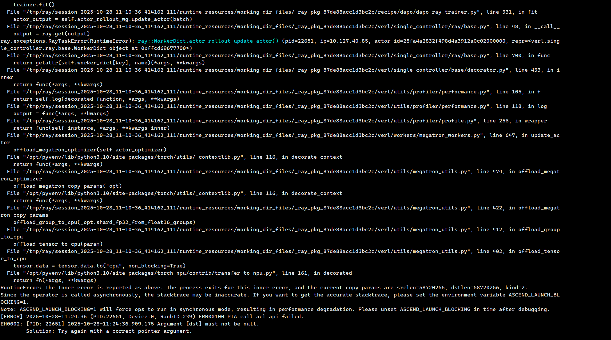
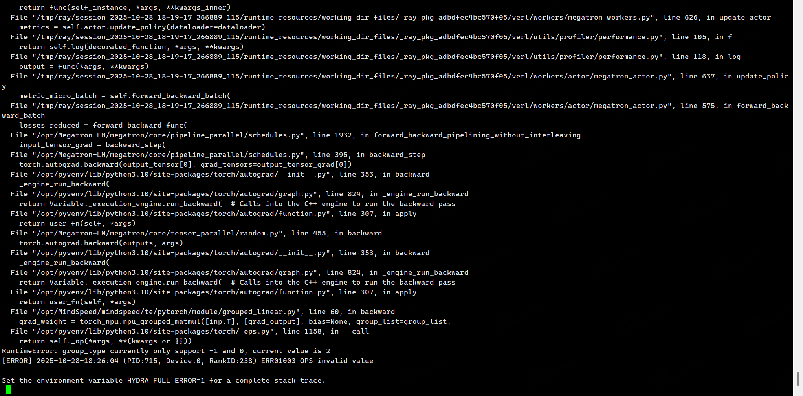

## 参数报错记录表

   +actor_rollout_ref.actor.optim.override_optimizer_config.optimizer_cpu_offload=True\

这个参数NPU用不了



## MLA 适配部分

### group_type currently only support -1 and 0, current value is 2



## 替换对应的包

在 `start.sh`里面添加代码


比如你在 `/data01/huawei-2025/tmp/vllm-ascend-0110/` 放了一个新的vllm-ascend的代码，然后想要替换掉原来的`vllm-ascend`的包，那么在`start.sh`里面添加一段执行代码，这样执行

```bash

rm -rf /opt/vllm-ascend
cp -rf /data01/huawei-2025/tmp/vllm-ascend-0110 /opt/vllm-ascend

```


## 适配MLA

适配MLA就是要换一个新的MindSpeed上去，

示例脚本：

`k8s/patch/apply_mindspeed.sh`

### 适配逻辑

1. 在 `/home/code/verl-gpu/tmp/MindSpeed` 下放了一个新的MindSpeed代码，切换到 `origin/2.2.0_core_r0.12.1` 然后想要替换掉原来的MindSpeed的包

2. 在`start.sh`里面添加一段执行代码，替换掉掉原来镜像里的`/opt/MindSpeed`的MindSpeed的包

3. 还有一个代码要回退，`\cp k8s/patch/mindspeed.patch/2.2.0_core_r0.12.1/MindSpeed/mindspeed/te/pytorch/module/grouped_linear.py /opt/MindSpeed/mindspeed/te/pytorch/module/grouped_linear.py`

